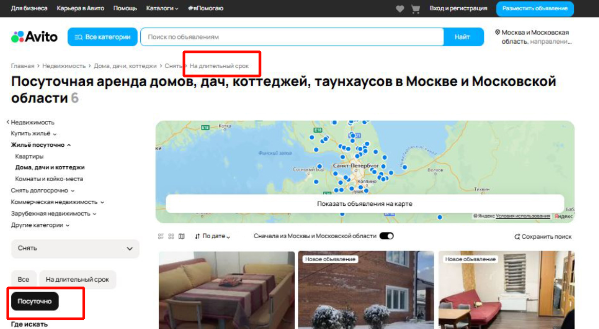
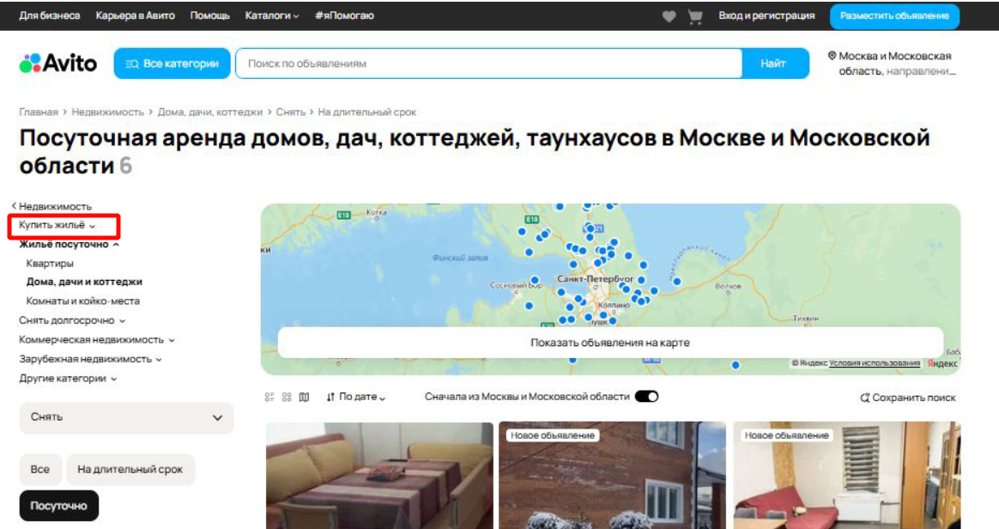
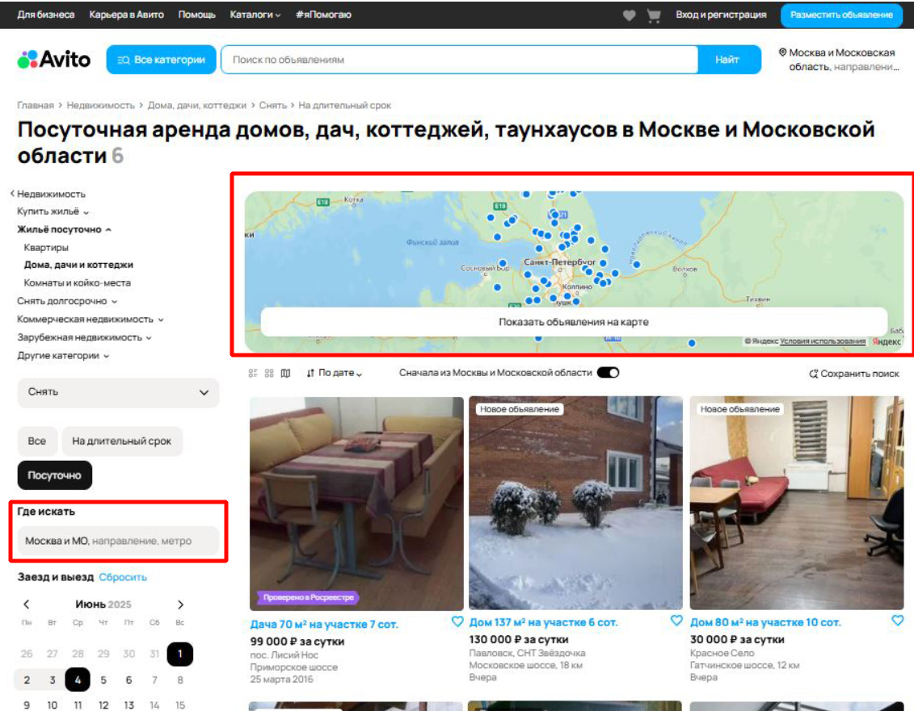
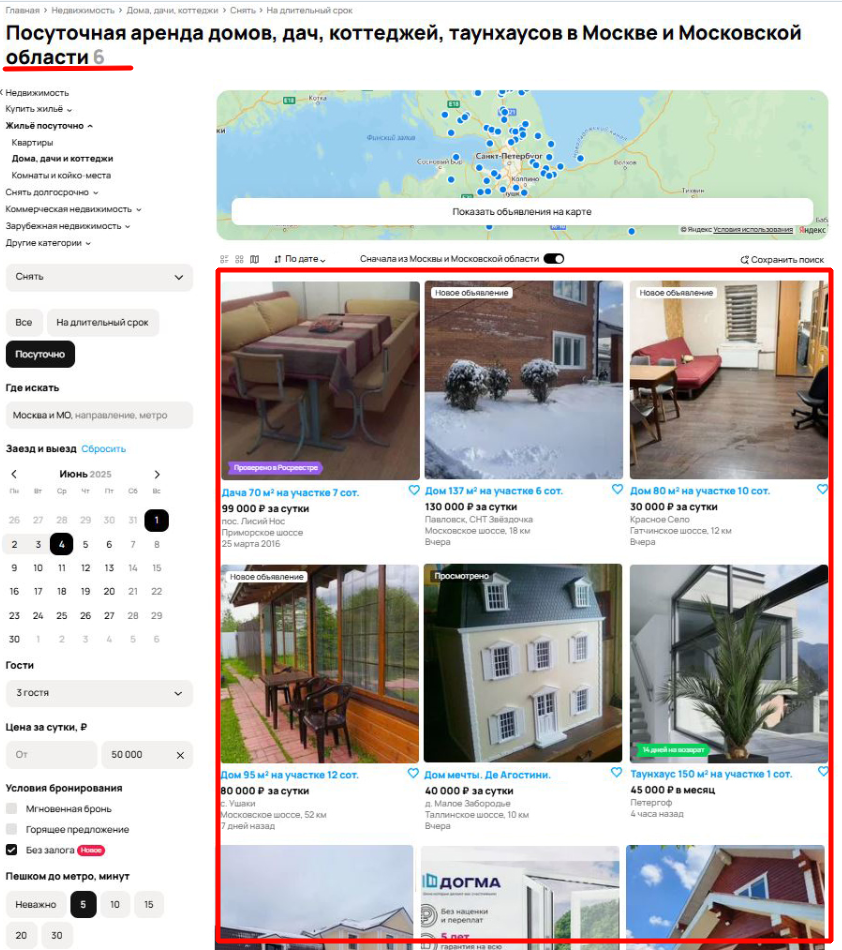
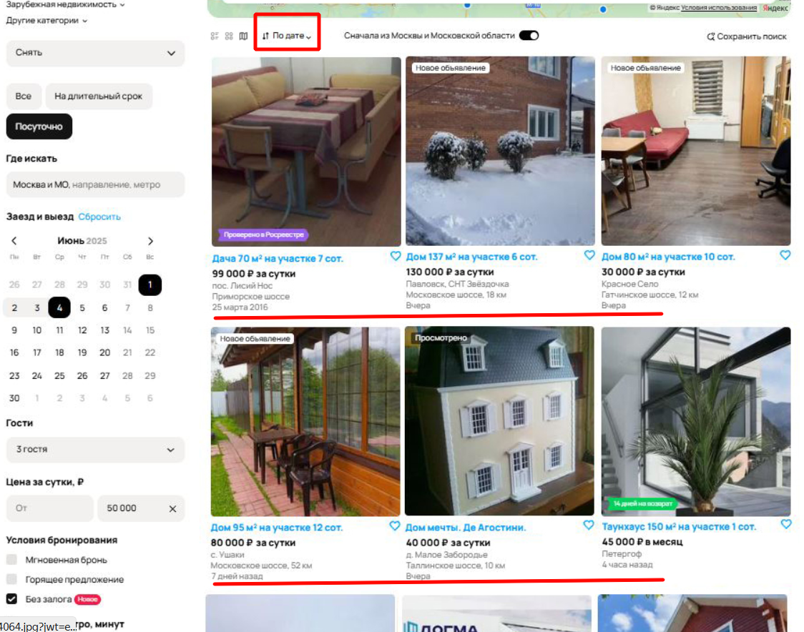
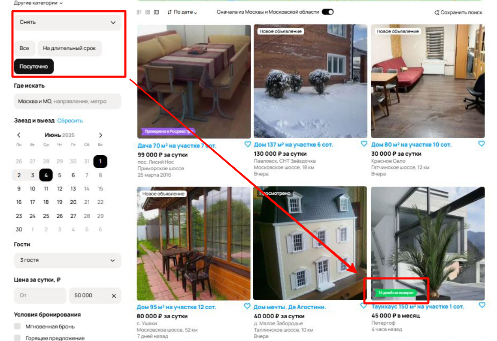
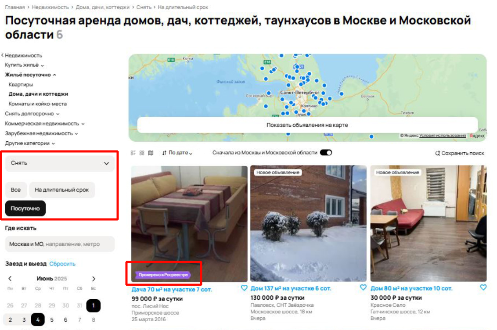

# Задание №1
Описание:
1. Формат отчёта
Изначально рассматривал оформление баг-репортов через систему Issues, однако учитывая значительное количество найденных дефектов (более 20), для удобства просмотра принял решение структурировать их в файле README.md.
2. Критерии классификации
Помимо стандартного приоритета (priority), дополнил отчёт показателем серьёзности (severity), поскольку считаю, что это важный параметр для полноценной оценки критичности каждого дефекта.
3. Поскольку в условиях задания предоставлен только скриншот без конкретных требований, в процессе анализа ориентировался на текущую production-версию сервиса. В связи с этим все выявленные дефекты разделены на две категории:
* Явные (очевидные несоответствия, не требующие дополнительных источников для верификации)
* Неявные (расхождения, выявленные только при сравнительном анализе с рабочей версией продукта)
4. Шаги воспроизведения
Чтобы не повторять одно и то же, они будут описаны только во втором баг-репорте.
---------------------

### ID1. В слове "Найти" на кнопке поиска отсутствует буква И
**Шаги воспроизведения**  
1. Откройте страницу поиска.  

*Фактический результат:* В слове "Найти" на кнопке поиска отсутствует буква И.

*Ожидаемый результат:* Слово "Найти" на кнопке поиска написано без ошибок.

*Priority:* high.

*Severity:* low.

---

### ID2. В хлебных крошках отображается фильтр "На длительный срок", хотя выбрана посуточная аренда
**Шаги воспроизведения**  
1. Откройте страницу поиска.
2. Выбрать категорию "Недвижимость".
3. Выбрать "Дом. дача, коттедж" в дропдауне вида жилья.
4. Выбрать "Снять" в дропдауне вида взаимодействия с жильем.
5. Выбрать "Посуточно".
6. В поле "Даты" выбрать 4 дня.
7. Клик на кнопку поиска (Показать более n объявлений)

*Фактический результат:* В хлебных крошках отображается фильтр "На длительный срок", хотя выбрана посуточная аренда.

*Ожидаемый результат:* В хлебных крошках отображается фильтр "Посуточно".

*Priority:* medium.

*Severity:* medium.

---

### ID3. В меню категорий отображается "Купить жилье" при поиске арендного жилья
**Шаги воспроизведения**  
1. Откройте страницу поиска.  

*Фактический результат:* В меню категорий отображается "Купить жилье" при поиске арендного жилья.

*Ожидаемый результат:* В меню категорий отображается "Снять жилье".

*Priority:* medium.

*Severity:* medium.

---

### ID4. При поиске на карте отображается отличный от выбранного город
**Шаги воспроизведения**  
1. Откройте страницу поиска.  

*Фактический результат:* На карте отображается Санкт-Петербург.

*Ожидаемый результат:* На карте отображается Москва и МО.

*Priority:* high.

*Severity:* high.

---

### ID5. Число найденных объявлений в шапке поиска не соответствует действительному количеству найденных объявлений
**Шаги воспроизведения**  
1. Откройте страницу поиска.  

*Фактический результат:* В шапке поиска отображается цифра 6 в количестве объявлений.

*Ожидаемый результат:* В шапке поиска отображается число n в количестве объявлений (Не могу написать точное число, так как не могу посмотреть запрос).

*Priority:* medium.

*Severity:* low.

---

### ID6. При поиске не работает сортировка по дате
**Шаги воспроизведения**  
1. Откройте страницу поиска.
2. Выбрать сортировку по дате.

*Фактический результат:* Объявления отсортированы беспорядочно.

*Ожидаемый результат:* Объявления отсортированы по дате.

*Priority:* medium.

*Severity:* medium.

---

### ID7. При поиске съемного жилья на объявлении отображается условие "14 дней на возврат"
**Шаги воспроизведения**  
1. Откройте страницу поиска.

*Фактический результат:* На объявлении отображается условие "14 дней на возврат".

*Ожидаемый результат:* На объявлении не должно отображаться такое условие, так как это услуга, а не товар.

*Priority:* medium.

*Severity:* low.

---

### ID8. При поиске съемного жилья на объявлении отображается условие "Проверено в Росреестре"
**Шаги воспроизведения**  
1. Откройте страницу поиска.

*Фактический результат:* На объявлении отображается условие "Проверено в Росреестре".

*Ожидаемый результат:* На объявлении не должно отображаться такое условие, так как такое условие отображается на недвижимости на продажу.

*Priority:* medium.

*Severity:* low.

---